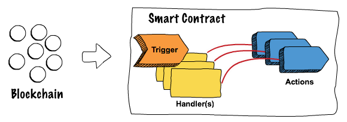

  

  <b>Project Dovetail™ is a complete set of tools for modelling blockchain decentralized apps</b>

  <a href="#project-dovetail">Dovetail™</a> | <a href="#hyperledger-fabric">Hyperledger Fabric</a> | <a href="#r3-corda">R3 Corda</a> | <a href="#contributing">Contributing</a> | <a href="#license">License</a>

 

# Introduction

Developing blockchain solutions with today’s technology is challenging given the lack of tooling and standardization. Project Dovetail™ by TIBCO LABS™ addresses these issues by providing a graphical interface for modeling smart contracts and client applications, making them easier to write, visualize, test, and audit, all without deep programming experience.

Application logic is abstracted from low-level code, and contracts can be developed for different blockchain frameworks with little or no code. On-chain and off-chain computation can become more seamless, time to market is improved, and the risk of technology lock-in is reduced. Project Dovetail makes your smart contracts smarter.

 

  

# What are Smart Contracts

There are many definitions and descriptions of smart contracts, as each blockchain framework tends to implement this capability in its own way (if it does implement this feature at all). However, generally speaking, smart contracts (at least from an enterprise / permissioned perspective) may be thought of as application or business logic (defined in code) that runs within the context of a blockchain network itself.

The idea is to automate the processing of blockchain transactions across the network, use the logic to determine if a transaction will get written to the ledger, and to maintain accuracy, compliance, and trust. In essence, smart contracts represent a method for controlling how changes are made to the underlying blockchain, in a non-centralized and (potentially) untrustworthy environment. Supply chain transaction tracking, healthcare revenue cycle management, consumer contract execution, and government interactions are all areas in which smart contracts (business logic) may be applied. Remember, however, that "smart contracts" are not necessarily "smart" (depends on the code) nor "contracts" (as they may not be viewed as legal contracts). Thus, the term can be a bit misleading.

# Project Dovetail

Project Dovetail™ is a framework that allows for the end to end design, development, testing, and deployment of blockchain smart contracts. Project Dovetail™ allows you to develop smart contracts based on a series of models, helping to:

- **Increase security** since the modeling abstraction layer will allow for reusable and tested code derived from the model.
- **Simplify** development via an extendable abstraction layer (flow model)
- **Decouple** your code from the underlying blockchain technology
- **Reduce** the amount of code needed
- **Increase visibility** and audit-ability
- **Allow customizable modeling** for your industry
- **Expose** a better UI for the design of smart contracts

# Dovetail Core

Dovetail is based on TIBCO FLOGO™, an event-driven app framework used to develop apps for the cloud & IoT edge. It can also be thought of as a lightweight _app kernel_ used by open source & commercial solutions like Dovetail here. The trigger used is based on the cli to generate or transpile your smart contract logic into blockchain technologies languages: R3 Corda, HyperLedger Fabric...

Dovetail Core provides the following key benefits:

⛓ **Action chaining** enables communication between one or more capabilities in a single, sub 10MB binary! 
🏗 **Common contribution model** build activities and triggers that can be leveraged by all capabilities 
🔨 **Extensible** easily extend the capabilities available by building your own action using the common interfaces 

## Dovetail Core Contribution Model

Dovetail™ Core exposes three principal contribution interfaces that enable developers to build common capabilities and functionality. These contribution interfaces include:

- **Connector Interface** a common interface for importing predefined schemas into Dovetail, Hyperledger Composer Connector is an example.
- **Trigger Interface** a common interface for building event-consumers that dispatch events to one or more actions. The Smart Contract TXN Trigger is an example of a trigger.
- **Activity Interface** a common interface for exposing common application logic in a reusable manner. Think of this as a function, such as write to ledger, publish events, etc that can be used by all Dovetail apps.

# Dovetail Flows

Dovetail Flows provides smart contract logic design capabilities and includes the following key highlights.

🌈 **Painless development** Visual modeler with step-back debugging capabilities & elegant DSL 
⚙️ **Ultra-light process engine** for conditional flow control

# Hyperledger Fabric

Dovetail supports the end-to-end application depvelopment for [Hyperledger Fabric](https://www.hyperledger.org/use/fabric), including zero-code development of chaincode and client applications, and deploy and test applications in cloud provided by Microsoft Azure, Amazon Web Services, Google Cloud, or IBM Cloud.

The following repositories contain components, tools, and instructions for the development of Hyperledger Fabric applications by using the Dovetail™.

- [Fabric CLI](https://github.com/dovetail-lab/fabric-cli) is the place to get started on configuring the development environment, and building Hyperledger Fabric applications.
- [Fabric Samples](https://github.com/dovetail-lab/fabric-samples) contains Dovetail application samples. Each sample includes a Hyperledger Fabric chaincode to be deployed on a blockchain network, and 1 or 2 client service applications that will interact with the blockchain network. The [marble](https://github.com/dovetail-lab/fabric-samples/tree/master/marble) app can be the first sample to look into because it implements the same application logic as the classic [marbles02](https://github.com/hyperledger/fabric-samples/tree/master/chaincode/marbles02) chaincode of the Hyperledger Fabric.
- [Fabric Chaincode](https://github.com/dovetail-lab/fabric-chaincode) contains Flogo extensions for Hyperledger Fabric chaincode. It supports all chaincode activities, including ledger and private data management, as well as chaincode invocation and event creation. The activities, trigger, and functions implemented in this repository can be used as samples to implement more Flogo extensions to support future Hyperledger Fabric functionality.
- [Fabric Client](https://github.com/dovetail-lab/fabric-client) contains Flogo extensions for Hyperledger Fabric client applications. It supports query and invocation of chaincode transactions, as well as listener of block and chaincode events. A Hyperledger Fabric client application is an orchestration service that can interact with the blockchain, and any non-blockchain systems by using open-source Flogo extensions such as those in [Flogo contrib](https://github.com/project-flogo/contrib) or [Flogo Community](https://tibcosoftware.github.io/flogo/showcases/) or extensions packaged with the [TIBCO Flogo Enterprise](https://www.tibco.com/products/tibco-flogo).
- [Fabric Operation](https://github.com/dovetail-lab/fabric-operation) contains tools for easily creating Kubernetes clusters locally and in cloud, and creating Hyperledger Fabric network in the Kubernetes cluster, and deploying chaincode and client applications for the fabric network. It currently supports Microsoft Azure, Amazon Web Services, Google Cloud, and IBM cloud.

# R3 Corda

Dovetail support for R3 Corda can be found [here](https://github.com/TIBCOSoftware/dovetail-contrib/tree/master/corda).

# Dovetail Documentation

More Dovetail documentation can be found on the [documentation page](https://tibcosoftware.github.io/dovetail/).

# Contributing

Want to contribute to Project Dovetail? We've made it easy, all you need to do is fork the repository you intend to contribute to, make your changes and create a Pull Request! Once the pull request has been created, you'll be prompted to sign the CLA (Contributor License Agreement) online.

Not sure where to start? No problem, here are a few suggestions:

- [dovetail-lab](https://github.com/dovetail-lab): This contains the latest source code of Dovetail contributions supporting the development and deployment of Hyperledger Fabric applications. You may fix issues or create new Flogo extensions or deployment tools for Hyperledger Fabric applications.
- [dovetail-contrib](https://github.com/TIBCOSoftware/dovetail-contrib): This repository contains all of the contributions, such as activities, triggers, etc. Use this repository for contributions on R3/Corda or blockchain frameworks other than Hyperledger Fabric. Create a new activity or trigger or fix a bug in an existing activity or trigger.
- Browse all of the Project Dovetail repositories and look for issues tagged `kind/help-wanted` or `good first issue`

If you have any questions, feel free to post an issue and tag it as a question or email <tibcolabs@tibco.com>.

For additional details, refer to the [“Contribution Guidelines”](./CONTRIBUTING.md).

# License

The top level flogo repo, consisting of flow samples & documentation, is licensed licensed under a BSD-style license. Refer to [LICENSE](./LICENSE) for license text.

Dovetail source code maintained under [dovetail-lab](https://github.com/dovetail-lab) are all licensed under a BSD-style license, refer to [LICENSE](./LICENSE).
